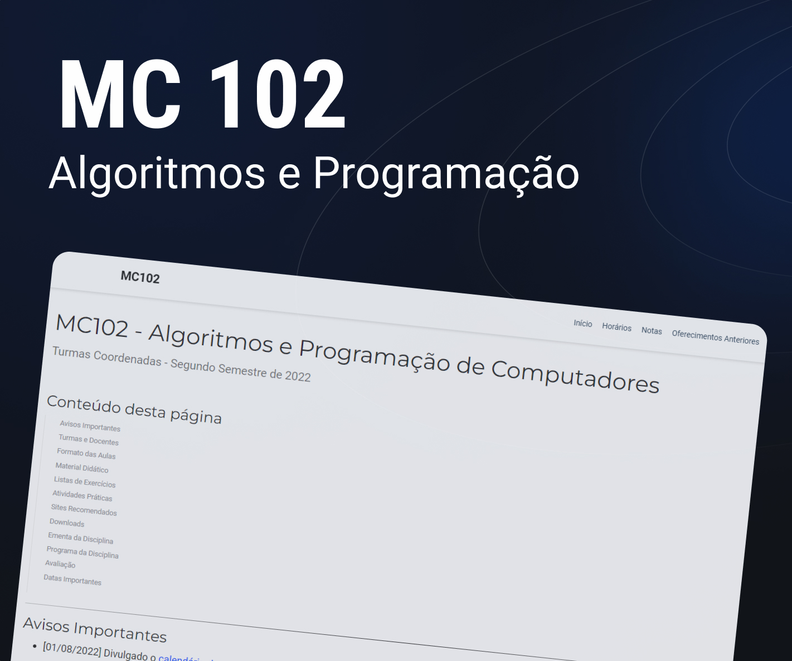

<h1 align="center"> MC102 - Algoritmos e Programação de Computadores </h1>

Mentoria de Lógica de Programação e Linguagem Python.

  <a href="#-tecnologias">Tecnologias</a>&nbsp;&nbsp;&nbsp;|&nbsp;&nbsp;&nbsp;
  <a href="#-projeto">Projeto</a>&nbsp;&nbsp;&nbsp;|&nbsp;&nbsp;&nbsp;
  <a href="#memo-licença">Licença</a>

  

 

  

## 🚀 Tecnologias

Esse projeto esta sendo desenvolvido com as seguintes tecnologias:

- Python
- Git e Github

## 💻 Projeto

O Projeto trata de estudos de Algoritmos e Programação de Computadores, você pode visualizar página oficial das Turmas Coordenadas através [DESSE LINK](https://www.ic.unicamp.br/~mc102/).

## 📝Licença

Esse projeto está sob a licença MIT.

---

# mc102-2s-2022
Create a Pull Request agains this repository https://github.com/helen-fornazier/mc102-2s-2022/
